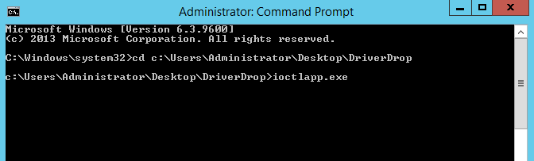
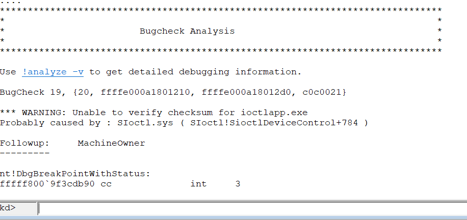
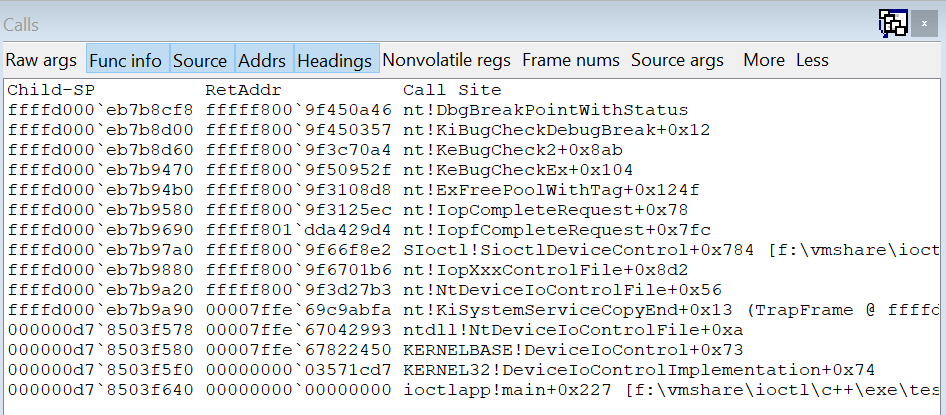
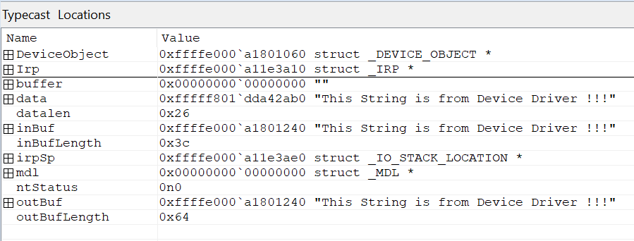
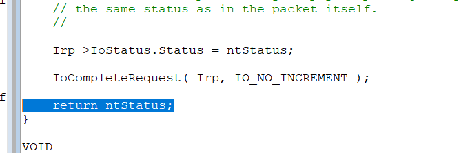
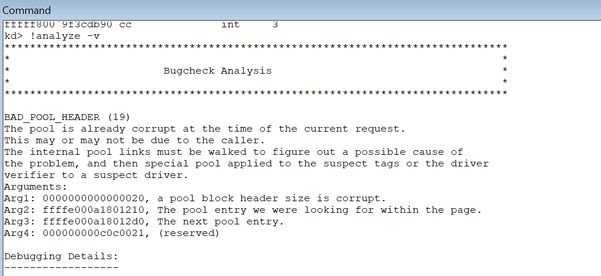
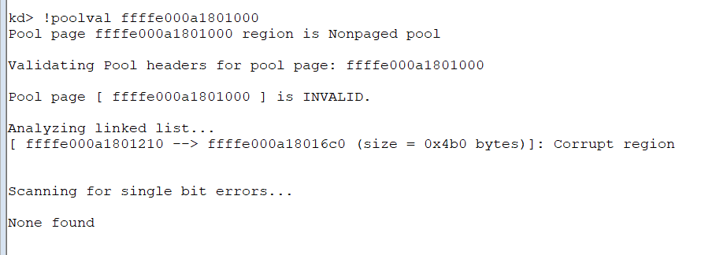

# WIP: Setting up a development and Debugging environment for developing a Windows 8.1/Server2012 kernel mode driver 
## TL;DR
Following up from my first [Kernel Debugging](kerneldebug1.md) post, in this post I show you how to start developing and debugging a driver on the VirtualBox VM prepared in that article using VisualStudio and WinDbg.

## Tools & Software
* Visual Studio Code
* VisualStudio 2013
* WDK 8.1
* WinDbg
* Windows 8.1 or Server 2012 R2 for the target computer
* An up-to-date version of VirtualBox (version 5.1 at the time of writing)
* I have Windows 10 Pro on my host

## Setting up the development environment and workflow
The target computer will be the Windows instance (8.1 or Server 2012, they are practically the same but I prefer 2012 because I can't handle the 8.1 UI...)

I've got VisualStudio 2013 installed on the host and you can also install it on the guest for local, user mode, debugging (more about why you might want that later), but WinDbg from the WDK is my choice as it's more performant and requires less guest resources.

Folder setup is as follows;
* Source lives on the host machine, and I edit and build using Visual Studio 2013 on the host
* I have shared folder between the VirtualBox VM and the host where the build artefacts from the project are output to (I add a post-build step to the project(s)). On my host it is ```F:\VmShare``` and I will be using that path in the rest of this post.
* Because of a quirk with the VirtualBox shared folder driver, loading a driver from that folder doesn't work (or I can't get it to work at least) - so I have a batch file in the folder that I execute *on the target* to copy the artefacts on to a target-local drive (i.e. not one that is shared). I'll come back to this later.

My workflow is
* Edit and build on the host using VisualStudio 2013, binaries and PDBs go into the shared folder
* Run the batch file on the target to copy the files into a local folder
* Run exes, load drivers, etc, from that folder
* Debug kernel from the host (using WinDbg), user mode from the target (also Windbg), loading PDBs from the shared folder  

On the target VM, using VIrtualBox's UI I create a folder share between the target and the host. 

## Prerequisites
In addition to the VirtualBox and WinDbg setup from my first post, you will need to install the following;
* [VisualStudio 2013](https://visualstudio.microsoft.com/vs/older-downloads/) on the Host (as mentioned before you don't really need it on the guest)
* [WDK 8.1](https://www.microsoft.com/en-gb/download/details.aspx?id=42273) on *both* host and guest 

## Workflow
### With WinDbg
You will write code and build for the 8.1 target on the Host, but obviously the driver and other code needs to execute on the guest. To simplify the process of getting things from the host to the guest you should set up a shared folder in VirtualBox that the guest (and host) have access to. Here you can drop files between the two. On that note; you should enable shared clip-board functionality between the host and guest as well, it's useful.

### With VisualStudio
Unfortunately I have not been able to get VisualStudio to work for kernel debugging. Provisioning ([MSDN](https://msdn.microsoft.com/en-us/library/windows/hardware/hh698272(v=vs.85).aspx)) failed for me on VMs and physical machines alike, leaving the network card in a "hung" state waiting for the kernel debugger boot process to finish. This appears to be a known issue, and in fact Microsoft has ended support for this functionality with 2017. In fact, the internet empirically suggests that anything but serial cable debugging (real or virtual) is broken or unreliable when it comes to kernel development in Windws, see for example [this post](https://www.nccgroup.trust/uk/about-us/newsroom-and-events/blogs/2016/april/adventures-in-windows-driver-development-part-1/), so I've settled on the serial cable aproach and even though it's not very performant it works well.

### Workstation requirements
A performant workstation is needed for kernel development. We will be running the guest OS in a VM, and we will be running tools like VisualStudio and WinDbg on both the host and the guest. A 16Gig RAM, 4+ core, host machine is a must and an SSD backed store absolutely recommended. There is no "hit F5" or niceties like [Live++](https://molecular-matters.com/products_livepp.html) support for kernel development and you want to cut down on overhead and wait times as much as possible, especially as the guest VM will frequently be rebooted.

## Debugging a Crash
To exercise the workflow and learn more about debugging kernel drivers I modified ```IOCTL``` example driver from the [WDK 8.1 samples](https://code.msdn.microsoft.com/windowsapps/Windows-Driver-Kit-WDK-81-cf35e953/file/140598/1/windows-driver-kit-81-cpp.zip). I picked this particular example because it demonstrates a "software driver", i.e. a driver that doesn't control an actual hardware device. It also demonstrates how a user mode application can load and unload a driver on demand. This is the sort of driver I am personally interested in developing, hence the choice.

Install the sample code and load the IOCTL sample solution. It contains three projects
* ioctlapp 
* Package
* siotl

```ioctlapp``` is a user-mode executable that loads the ```sioctl.sys``` driver, makes calls to it using the [DeviceIoControl API](https://msdn.microsoft.com/en-us/library/windows/desktop/aa363216(v=vs.85).aspx) and then unloads it. 

Modify the project files by adding a post-build step to the ```ioctlapp``` and ```sioctl``` so that the build output goes to the shared folder ```F:\VmShare```. However, this is not enough to run the code. With the version of VirtualBox I am using at the time of writing (5.1) Windows will not load the driver from the share (at least not in the way that ```ioctlapp``` does it) and you will have to copy the binaries one more time into a non-shared local folder on the target machine. This complicates the work flow a litle bit, but I have a batch file in the shared folder which I run *from the target VM* each time I have built new binaries and which copies the files into a local folder. On my target that folder is on the desktop of the ```Administrator``` user;

```c:\Users\Administrator\Desktop\DriverDrop```

(you can obviously put it anywhere you like on the target.)

Now build the solution and make sure the binaries are copied into the target local folder. On the target machine, open a Windows command prompt, cd into your version of my "DriverDrop" folder, and run 

```ioctlapp.exe```

You will see [IMAGE]

### Make it crash
We will modify the ```sioctl.c``` driver source to create a crash. 
A simple ```nullptr``` access would do, but it's a bit too easy to track down so instead I added a buffer overrun that will cause a crash, but not directly at the modified site. 

Open the file and go to line ```347``` where the driver copies data back into a buffer that is passed back to the user mode application (```ioctlapp```)

```c
//
// Write to the buffer over-writes the input buffer content
//

RtlCopyBytes(outBuf, data, outBufLength);
```

We brutally and directly create a buffer overrun;

```c
RtlCopyBytes(outBuf, data, outBufLength + 1024);
```

Build the solution again and run ```ioctlapp.exe```. What do you think will happen?



At this point my target Windows Server 2012 R2 hangs, hard. Nothing moves, nothing responds. We're dead. You might even have to force quite the VM.

### Debug it
Fire up WinDbg and make sure everything is set up for serial debugging, as in my [Kernel Debugging](kerneldebug1.md) post. You need to start the VM normally so that the COM pipe is available.

[TODO] WinDBG sequence, set up symbol and source paths etc.

Now run ```ioctlapp.exe``` again. The crash is caught in WinDbg this time



Notice that it's actually an ```int 3``` instruction, and looking at the callstack we see the following;



The top of the stack, and the location that triggered the ```int 3``` which when unhandled caused our VM to bomb out so completely, is ```DbgBreakPointWithStatus```. 


---






* Edit sioctl.c to create a buffer overrrun
* the crash happens when leaving the SioctlDeviceControl function (stack corrruption)
* Notice that the ```irpSp->Parameters.DeviceIoControl.IoControlCode``` fields are all 0...suspicious!
* insert a ```__debugbreak()``` statement befoe the switch and run again, notice now how the ```IoControlCode``` field is valid (```0x9c402408```) 
